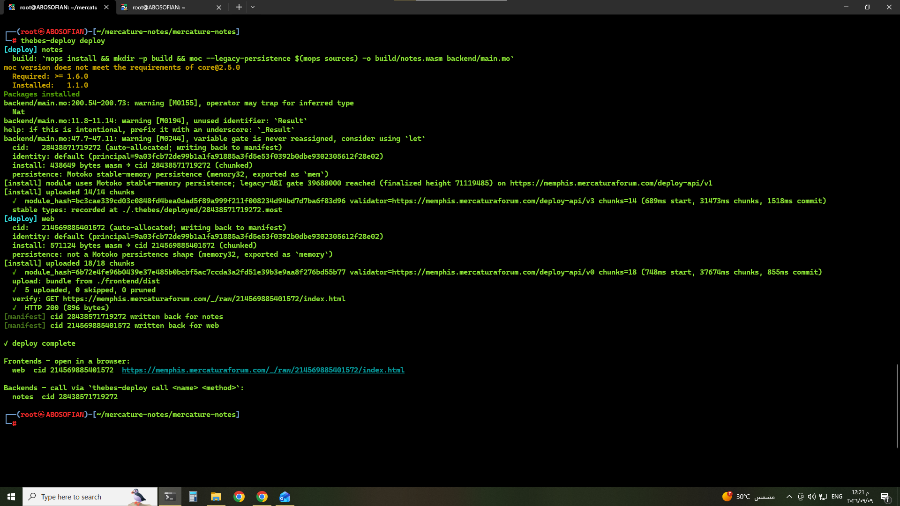

# mercature-notes — Task 3: share & tip



## Live demo

- **App:** https://memphis.mercaturaforum.com/_/raw/214569885401572/index.html
- **Frontend canister (`web`):** `214569885401572`
- **Backend canister (`notes`):** `28438571719272`
- Deployed with `thebes-deploy deploy` on Memphis (`memphis.mercaturaforum.com`) — see the terminal screenshot above (`deploy.png`: `✓ deploy complete`, `HTTP 200`, both cids written back to the manifest).

## What's new
- `shareNote` / `unshareNote` — toggle a note's `shared` flag (owner-only).
- `feed` — a plain `query` (no session needed) returning every shared note with its author.
- `myBalance`, `myTipHistory` — identity-checked, so `shared`/update not `query`.
- `tip(session, noteId, amount)` enforces both rules before moving points:
  - Rule 1 — `amount > myBalance` → rejected
  - Rule 2 — `note.owner == caller` → rejected
- Every principal is lazily granted 100 points **once**, the first time it's seen
  (in `createNote` or the first tip either direction) — never re-granted after that.
- **Bonus — `ledgerSealView`** (named and shaped after Session 6's slide exactly:
  `{ members; circulation; expected; consistent }`): total points in
  circulation must always equal `100 × members`, since tipping only moves
  points between balances, never creates or destroys them. Rendered in the
  page footer as a small trust check.
- **Bonus — image attachment: not implemented.** `Note` has no `imagePath`
  field at all (not even a stub) — the frontend SDK's Candid decoder can't
  decode `opt`/optional fields, so any record carrying one can't be read
  back client-side. Wiring this up for real means giving media its own
  contract call via thebes-lib's `Media` module (chunked upload, quotas, the
  certified media tree), not a field on `Note` — that's a meaningfully
  bigger piece of work than the rest of this task, so it's left as a TODO.
  Read the `Media` module's header comment in thebes-lib before building it.

## Untouched, on purpose
The Memphis gate line is byte-for-byte identical to Task 2:
```
var gate = MemphisAuth.initFromCid(921, "mercature-notes", 1);
```
Do not edit this line or re-call `initFromCid` anywhere else.

## Deploy
```
mops install
thebes-deploy build
thebes-deploy deploy
```

`asset_canister.wasm` (at the project root) is committed here — it's the
`type = "frontend"` canister's wasm, a separate release artifact from
`thebes-deploy` itself (Mercatura-Forum/Thebes-Protocol-, release
`asset-canister-v0.1.0`), not something `thebes-deploy build` produces. If
it's ever missing, `thebes-deploy deploy` fails with:
```
Error: read wasm ./asset_canister.wasm
Caused by:
    No such file or directory (os error 2)
```
Re-fetch it from the release page and verify before using it:
```
curl -fL -o asset_canister.wasm \
  https://github.com/Mercatura-Forum/Thebes-Protocol-/releases/download/asset-canister-v0.1.0/asset_canister.wasm
echo "6b72e4fe96b0439e37e485b0bcbf5ac7ccda3a2fd51e39b3e9aa8f276bd55b77  asset_canister.wasm" | sha256sum -c
```

Passkey sign-in pins its relying-party id to the served origin, so it does
not work from `npm run dev` on localhost — deploy first, then test sign-in
on the served `memphis.mercaturaforum.com/_/raw/<cid>/...` URL.
